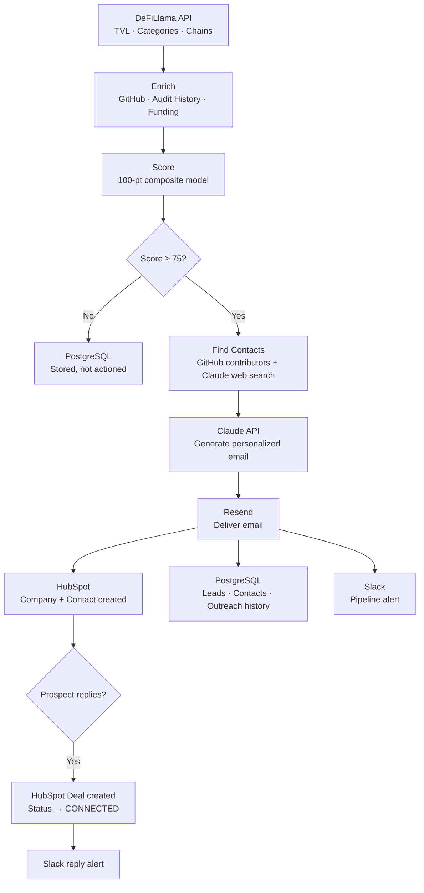
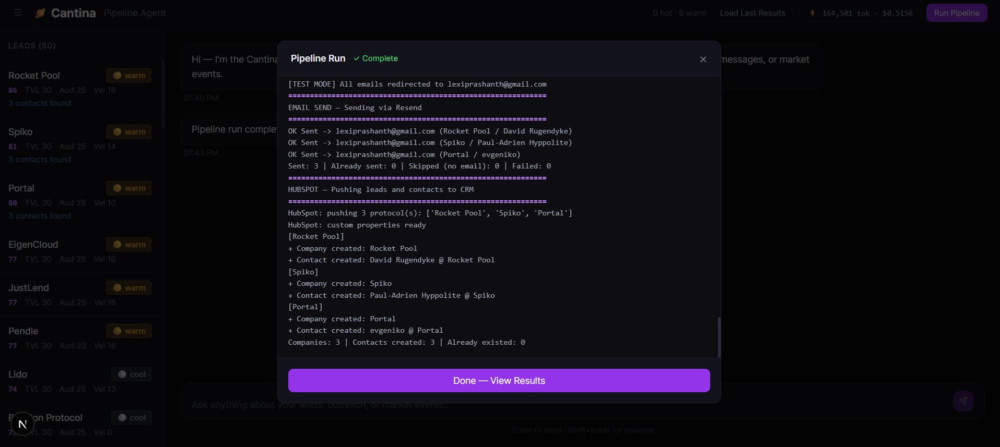
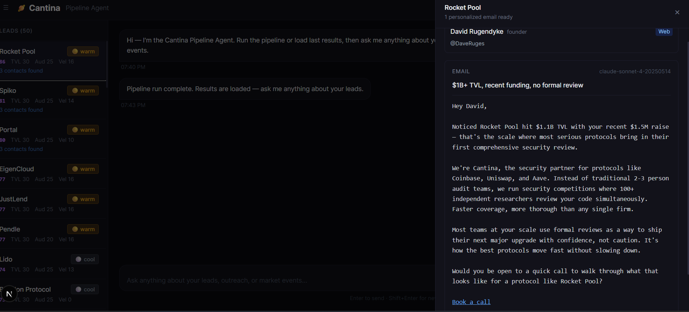
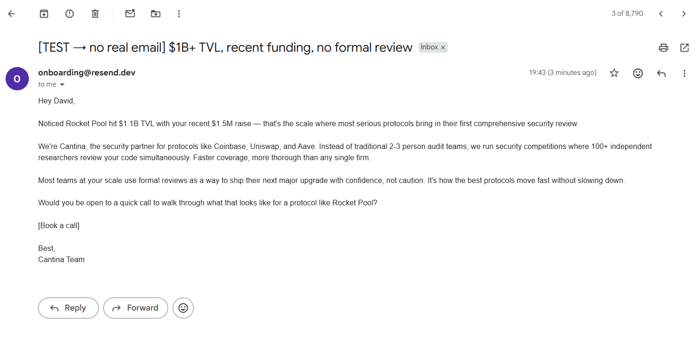
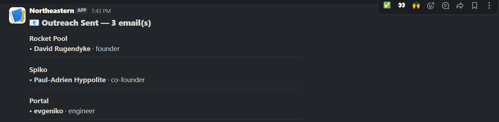
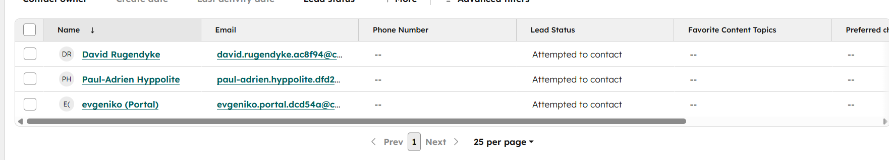
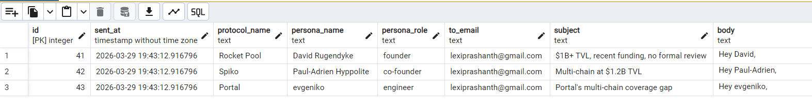

# Cantina Discovery Pipeline

AI-powered GTM system for Web3 security sales. Discovers, scores, and reaches out to Web3 protocols most likely to need Cantina's services — security competitions, Clarion AI monitoring, and managed bug bounties. Can be extended to Web2 security as well.

---

## The Hypothesis

Web3 engineering teams are using Copilot, Cursor, and Claude Code to write Solidity and Rust smart contracts faster than ever. But AI-generated smart contract code is uniquely dangerous — a single vulnerability means **immediate, irreversible loss of funds**. Traditional audit cycles can't keep pace with AI-accelerated shipping. Cantina's platform — combining Clarion (AI code analyzer), 12,800+ researchers, competitions, and bug bounties — is built for this velocity.

**Why Hypothesis A over B:** Hypothesis A is a survival problem (get exploited or don't). Hypothesis B (tool consolidation) is an efficiency problem. Urgency books discovery calls.

---

## What It Does

1. **Ingest** — Pulls live protocol data from DeFiLlama (TVL, categories, chains)
2. **Enrich** — Fetches GitHub activity, audit history, funding, and team signals
3. **Score** — Weighted composite scoring across 5 signals (TVL, audit status, shipping velocity, funding recency, reachability)
4. **Contact enrichment** — Finds founders, CTOs, and security leads via GitHub contributors + Claude web search
5. **Outreach** — Generates personalized cold emails via Claude API, one per person found
6. **Send** — Delivers emails via Resend
7. **CRM** — Pushes leads and contacts to HubSpot (company + contact per person emailed)
8. **DB** — Persists everything to PostgreSQL (leads, contacts, outreach history)



---

## Architecture

```
cantina-discovery-pipeline/
├── frontend/              Next.js UI — chat + lead dashboard + draft drawer
├── scripts/
│   ├── api.py             FastAPI backend — all REST endpoints + LangChain agent
│   └── run_pipeline.py    Standalone CLI pipeline runner
├── src/
│   ├── pipeline/          ingest → enrich → score
│   ├── agents/            outreach_agent.py (Claude email generation), signal_agent.py
│   ├── integrations/      hubspot.py, email_sender.py, slack_alerts.py, contacts.py
│   ├── monitoring/        event_monitor.py (DeFiLlama exploit/funding detection)
│   ├── db/                store.py (PostgreSQL read/write)
│   └── utils/             claude_client.py, config.py, json_utils.py, token_tracker.py
├── config/
│   ├── scoring_weights.json   ICP definition — all scoring rules and discovery settings
│   └── .env.example           API keys and secrets template
└── docs/
    └── images/               Screenshots of the working system
```

---

## Tech Stack

| Layer | Technology |
|-------|-----------|
| Pipeline | Python 3.11+ |
| Web API | FastAPI + Uvicorn |
| Frontend | Next.js 14 (App Router) + Tailwind |
| Database | PostgreSQL + SQLAlchemy |
| AI / LLM | Claude API (Anthropic SDK) |
| Agents | LangChain ReAct |
| CRM | HubSpot API |
| Email | Resend |
| Monitoring | DeFiLlama hacks/funding APIs |
| Slack | Webhook (via requests) |

---

## Scoring Model

100-point composite score across 5 signals:

| Signal | Max pts | Logic |
|--------|---------|-------|
| TVL / funds at risk | 30 | >$1B = 30, $100M–$1B = 25, $10M–$100M = 20 |
| Audit status | 25 | Never audited = 25, stale = 22, shipping unaudited code = 20 |
| Shipping velocity | 20 | Daily commits + weekly deploys = 20 |
| Funding recency | 15 | Raised in last 3 months = 15 |
| Reachability | 10 | Warm intro = 10, doxxed + active Twitter = 8 |

**Tiers:** Hot ≥ 90 · Warm 75–89 · Cool < 75

All thresholds and weights live in `config/scoring_weights.json` — no code changes needed to tune the ICP.

---

## Setup

### 1. Python dependencies

```bash
cd cantina-discovery-pipeline
pip install -r requirements.txt
```

### 2. Environment variables

```bash
cp config/.env.example config/.env
# Fill in your keys
```

Required:
- `ANTHROPIC_API_KEY` — Claude API (outreach generation + contact search)
- `DATABASE_URL` — PostgreSQL connection string

Optional but recommended:
- `GITHUB_TOKEN` — raises GitHub rate limit from 60 to 5000 req/hr
- `HUBSPOT_API_KEY` — push leads/contacts to CRM
- `RESEND_API_KEY` + `RESEND_FROM_EMAIL` — send outreach emails
- `SLACK_WEBHOOK_URL` — pipeline completion + hot lead alerts
- `RESEND_TEST_EMAIL` — redirect all emails to one address during testing

---

### Getting a HubSpot API Key

1. Log in to [HubSpot](https://app.hubspot.com)
2. Go to **Settings** (gear icon, top right)
3. In the left sidebar go to **Integrations → Private Apps**
4. Click **Create a private app**
5. Give it a name (e.g. `Cantina Pipeline`)
6. Go to the **Scopes** tab and add the following:
   - `crm.objects.companies.read`
   - `crm.objects.companies.write`
   - `crm.schemas.companies.write`
   - `crm.objects.contacts.read`
   - `crm.objects.contacts.write`
   - `crm.schemas.contacts.read`
   - `crm.schemas.contacts.write`
7. Click **Create app** → **Continue creating**
8. Copy the token shown — this is your `HUBSPOT_API_KEY`

---

### Getting a Slack Webhook URL

1. Go to [api.slack.com/apps](https://api.slack.com/apps) and click **Create New App**
2. Choose **From scratch** → give it a name (e.g. `Cantina Pipeline`) → select your workspace
3. In the left sidebar go to **Incoming Webhooks**
4. Toggle **Activate Incoming Webhooks** to On
5. Click **Add New Webhook to Workspace**
6. Select the channel you want alerts posted to → click **Allow**
7. Copy the webhook URL shown — this is your `SLACK_WEBHOOK_URL`

### 3. Database

```bash
psql -U postgres -c "CREATE DATABASE cantina_pipeline;"
# Schema is created automatically on first pipeline run
```

### 4. Frontend

```bash
cd cantina-discovery-pipeline/frontend
npm install
npm run dev
```

### 5. Backend API

```bash
uvicorn scripts.api:app --port 8000 --reload
```

Once running, the interactive API docs are available at `http://localhost:8000/docs` — all endpoints are listed and callable directly from the browser.

---

## Running the Pipeline

Open `http://localhost:3000` — click **Run Pipeline** in the UI or chat with the agent.

The pipeline runs fully from the UI. No CLI needed.

| URL | What it is |
|-----|-----------|
| `http://localhost:3000` | Next.js UI — lead dashboard, chat agent, draft drawer |
| `http://localhost:8000/docs` | FastAPI interactive docs — all REST endpoints |

### Testing a Reply

To simulate a prospect replying, use the `POST /api/outreach/replied` endpoint directly from `http://localhost:8000/docs`:

```json
{
  "protocol_name": "Ethena",
  "persona_name": "Guy Young",
  "reply_body": "Thanks for reaching out, happy to chat."
}
```

This fires three things automatically:
1. **PostgreSQL** — outreach status updated to `replied`
2. **HubSpot** — contact status updated from `ATTEMPTED_TO_CONTACT` → `CONNECTED`, and a Deal is created in the Cantina Outreach pipeline
3. **Slack** — alert fired with the protocol name, persona, and reply content

### Pipeline Results



### Email Drafted



### Email Delivered



### Slack Alert



### HubSpot CRM



### Database



---

## Chat Agent

The UI includes a LangChain-powered agent (Claude) with tools:

| Tool | What it does |
|------|-------------|
| `get_pipeline_results` | List scored leads with tier filter |
| `get_outreach_draft` | Show all drafted emails for a protocol |
| `get_pipeline_summary` | High-level counts and top leads |
| `get_contacts` | Show contacts found for a protocol |
| `push_to_hubspot` | Push a lead to HubSpot CRM |
| `run_market_monitor` | Check DeFiLlama for exploits and funding rounds |
| `send_slack` | Send a message to the Slack channel |

---

## Configuration

All ICP and scoring settings are in `config/scoring_weights.json`:

```json
"discovery": {
  "min_tvl_usd": 50000000,
  "max_qualified_leads": 3,
  "max_contacts_per_protocol": 3,
  "target_categories": ["Dexes", "Lending", "Yield", ...]
}
```

`max_qualified_leads` is capped at 3 for demo cost management. In production, raise this or remove the cap and let the score threshold filter naturally.

---

## Token Tracking

The UI header shows live token usage and estimated cost for the current session. Resets on page reload or via the reset button. Tracks both pipeline Claude calls and chat agent calls.

---

## Key Files

| File | Purpose |
|------|---------|
| `scripts/api.py` | FastAPI app, LangChain agent, all endpoints |
| `scripts/run_pipeline.py` | CLI orchestrator + `RESEARCH_OVERLAYS` seed data |
| `src/agents/outreach_agent.py` | Claude email generation + fallback templates |
| `src/integrations/contacts.py` | GitHub + Claude web search for contacts |
| `src/integrations/hubspot.py` | HubSpot company + contact sync |
| `src/db/store.py` | PostgreSQL schema + read/write |
| `config/scoring_weights.json` | ICP definition — edit this to tune targeting |
| `frontend/src/app/page.tsx` | Main UI — chat, lead table, draft drawer |

---

## Instrumentation

If we book 10 discovery calls:

| Metric | Target |
|--------|--------|
| Booking rate | >15% |
| Hypothesis confirmation | >60% |
| Pain severity | ≥7/10 avg |
| AI for contracts confirmed | Track % |
| Next-step conversion | >50% |

**Confirmed signal at Day 30:** 6+ of 10 calls confirm AI code security gaps, severity ≥7/10, 3+ convert to next step → scale the pipeline.

---


